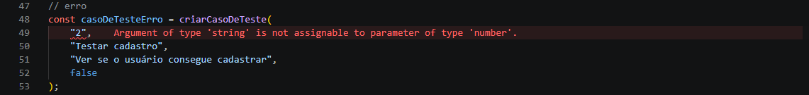

## Atividade TypeScript
### O que foi feito

Tipo CasoDeTeste criado, com as propriedades id, titulo, descricao e automatizado, e as funções criarCasoDeTeste, descrever e marcarAutomatizado. 

Além disso, foi criado um erro de tipo proposital para observar a mensagem apresentada pelo TypeScript.

### Como rodar

Requisitos: TypeScript, tsx 

Execute:
```
npx tsx src/atividades/casos-de-teste.ts
```

### Erro provocado

Uma string passou como primeiro argumento da função criarCasoDeTeste, onde se esperava um tipo number.

```
const casoComErro = criarCasoDeTeste(
    "1",    <----------- 
    "Testar login",
    "Testar login com credenciais válidas",
    false
);
```

O TypeScript acusou o erro de tipo porque "1" é uma string, enquanto o parâmetro foi definido como number devendo receber um número sem aspas.

